# Music 451C Exercise Report — W26 (2026/02/24)

**Piano Duet 2017 EEG Hyperscanning Study**

---

## 1. The Feedback-Related Negativity (FRN): Perception-Action, Joint Action, and Empathy

The Feedback-Related Negativity (FRN) is an event-related potential (ERP) component that peaks approximately 200–300 ms after the onset of unexpected or negative feedback, typically exhibiting a frontocentral scalp distribution. The FRN is thought to reflect a prediction error signal generated when actual outcomes deviate from expected outcomes, and it has been linked to the medial frontal cortex, particularly the anterior cingulate cortex (Ridderinkhof et al., 2004). In performance monitoring, the FRN indexes the brain's evaluation of whether actions achieved their intended goals, making it a key marker of the perception-action cycle — the continuous loop through which the brain generates motor commands, predicts sensory consequences, and adjusts behavior based on discrepancies between predicted and actual feedback (Blakemore & Decety, 2001).

The perception-action framework becomes especially relevant when considering how individuals monitor not only their own actions but also those of others. Research on the mirror neuron system has demonstrated that neurons in premotor and parietal cortices discharge both when an individual performs an action and when they observe the same action performed by another person (Rizzolatti & Craighero, 2004). This shared neural representation provides a mechanism by which observers can understand and predict others' actions by internally simulating them. In the context of performance monitoring, this means the brain may generate prediction errors not only for self-produced actions but also for observed actions, raising the question of whether the FRN is sensitive to errors made by others.

Joint action — coordinated activity in which two or more individuals act together to achieve a shared goal — requires participants to maintain shared representations of task goals, predict each other's actions, and integrate the predicted effects of both self and other (Sebanz et al., 2006). Musical ensemble performance is a paradigm example of joint action, as musicians must continuously monitor both their own performance and their partner's contributions to maintain temporal and tonal coordination. Loehr et al. (2013) demonstrated that pianists performing duets generate FRN and P300 responses not only to errors in their own playing but also to errors in the joint outcome, suggesting that the brain monitors multiple levels of action outcomes during joint performance.

Huberth et al. (2018) directly examined the FRN in a turn-taking piano duet using dual-EEG hyperscanning, manipulating partner type (human vs. computer), melody similarity (same vs. different), and agency (self vs. other). Their central finding was a significant main effect of agency on the FRN, *F*(1, 17) = 33.32, *p* < .001, with larger FRN amplitudes for altered feedback in one's own part compared to the partner's part. Notably, they found no significant effect of partner type, suggesting that the active nature of performing is more salient for performance monitoring than the biological animacy of the partner. They also reported that higher trait empathy was associated with less negative (i.e., reduced magnitude) self-FRNs (Spearman *r_s* = .48, *p* < .05), which they interpreted as highly empathic individuals suppressing their exclusive focus on self-monitoring during joint performance.

### References

Blakemore, S.-J., & Decety, J. (2001). From the perception of action to the understanding of intention. *Nature Reviews Neuroscience*, *2*(8), 561–567.

Huberth, M., Dauer, T., Nanou, C., Román, I., Gang, N., Reid, W., Wright, M., & Fujioka, T. (2018). Performance monitoring of self and other in a turn-taking piano duet: A dual-EEG study. *Social Neuroscience*, *14*(4), 449–461.

Loehr, J. D., Kourtis, D., Vesper, C., Sebanz, N., & Knoblich, G. (2013). Monitoring individual and joint action outcomes in duet music performance. *Journal of Cognitive Neuroscience*, *25*(7), 1049–1061.

Ridderinkhof, K. R., Ullsperger, M., Crone, E. A., & Nieuwenhuis, S. (2004). The role of the medial frontal cortex in cognitive control. *Science*, *306*(5695), 443–447.

Rizzolatti, G., & Craighero, L. (2004). The mirror-neuron system. *Annual Review of Neuroscience*, *27*, 169–192.

Sebanz, N., Bekkering, H., & Knoblich, G. (2006). Joint action: Bodies and minds moving together. *Trends in Cognitive Sciences*, *10*(2), 70–76.

---

## 2. Alpha Oscillations: Movement, Action Observation, Joint Action, and Empathy

Alpha oscillations (8–13 Hz) are among the most prominent rhythmic patterns in the human electroencephalogram. Over sensorimotor cortex, the alpha rhythm — often referred to as the mu rhythm — is characteristically suppressed (event-related desynchronization, or ERD) during movement execution and preparation, reflecting cortical activation of motor areas (Pfurtscheller & Lopes da Silva, 1999). Following movement, alpha power rebounds (event-related synchronization, or ERS), which has been interpreted as reflecting an "idling" state of the motor cortex (Pfurtscheller, 1996). This pattern of alpha ERD during active processing and ERS during cortical rest provides a window into the dynamics of cortical engagement during both movement and perception.

Critically, alpha ERD is not limited to overt motor execution. Hari and Salmelin (1997) demonstrated using magnetoencephalography that the rolandic mu rhythm is suppressed during both motor activity and passive observation of movements, suggesting that the sensorimotor cortex is engaged even when individuals are merely watching actions performed by others. This observation aligns with the mirror neuron framework: just as mirror neurons discharge during both action execution and observation (Rizzolatti & Craighero, 2004), the mu rhythm shows suppression in both contexts. Hari (2006) further established that the 20-Hz component of the mu rhythm is modulated during observation of hand movements, which has been proposed as an electrophysiological index of mirror neuron system activity, though this interpretation remains debated and may also reflect broader sensorimotor processing. Oberman et al. (2007) extended this by showing that mu suppression during action observation is correlated with social cognitive abilities, establishing a link between alpha dynamics and social functioning.

In joint action contexts, alpha oscillations serve as indicators of the attentional and motor resources individuals allocate to coordinating with a partner. Konvalinka et al. (2014) used dual-EEG during a dyadic finger-tapping task and found that leaders showed greater frontal alpha suppression than followers, suggesting that the leading role requires more prospective planning and self-monitoring. This asymmetry in alpha dynamics during interpersonal coordination highlights how musical roles can shape neural engagement patterns.

The relationship between alpha oscillations and empathy has been examined in musical contexts by Babiloni et al. (2012), who found that professional musicians observing ensemble performances showed frontal alpha modulation that correlated with self-reported empathy scores. This suggests that individuals with greater empathic tendency engage sensorimotor simulation processes more strongly during observation of social musical interactions. Washburn et al. (2019) built on these findings by examining alpha ERD during a piano duet task, reporting a significant interaction between melody similarity and partner animacy for starting performers. Specifically, when paired with a computer partner, starting performers showed alpha synchronization (power increase) in the similar-melody condition and alpha desynchronization in the dissimilar-melody condition, whereas this distinction was not present with a human partner. They interpreted this as evidence that starting performers attended less to a computer partner playing a similar accompaniment, operating in a "solo-like mode," whereas interaction with a human partner demanded sustained cortical engagement regardless of melody similarity. They also found that individual differences in trait empathy correlated with behavioral synchronization patterns across partner conditions, suggesting that empathy may indirectly influence the neural dynamics of joint musical performance.

### References

Babiloni, C., Buffo, P., Vecchio, F., Marzano, N., Del Percio, C., Spada, D., Rossi, S., Bruni, I., Rossini, P. M., & Perani, D. (2012). Brains "in concert": Frontal oscillatory alpha rhythms and empathy in professional musicians. *NeuroImage*, *60*(1), 105–116.

Hari, R. (2006). Action–perception connection and the cortical mu rhythm. *Progress in Brain Research*, *159*, 253–260.

Hari, R., & Salmelin, R. (1997). Human cortical oscillations: A neuromagnetic view through the skull. *Trends in Neurosciences*, *20*(1), 44–49.

Konvalinka, I., Bauer, M., Stahlhut, C., Hansen, L. K., Roepstorff, A., & Frith, C. D. (2014). Frontal alpha oscillations distinguish leaders from followers: Multivariate decoding of mutually interacting brains. *NeuroImage*, *94*, 79–88.

Oberman, L. M., Pineda, J. A., & Ramachandran, V. S. (2007). The human mirror neuron system: A link between action observation and social skills. *Social Cognitive and Affective Neuroscience*, *2*(1), 62–66.

Pfurtscheller, G. (1996). Post-movement beta synchronization: A correlate of an idling motor area? *Electroencephalography and Clinical Neurophysiology*, *98*(4), 281–293.

Pfurtscheller, G., & Lopes da Silva, F. H. (1999). Event-related EEG/MEG synchronization and desynchronization: Basic principles. *Clinical Neurophysiology*, *110*(11), 1842–1857.

Rizzolatti, G., & Craighero, L. (2004). The mirror-neuron system. *Annual Review of Neuroscience*, *27*, 169–192.

Washburn, A., Román, I., Huberth, M., Gang, N., Dauer, T., Reid, W., Nanou, C., Wright, M., & Fujioka, T. (2019). Musical role asymmetries in piano duet performance influence alpha-band neural oscillation and behavioral synchronization. *Frontiers in Neuroscience*, *13*, 1088.

---

## 3. FRN Amplitude Results

### ANOVA Results

We analyzed FRN amplitude data from 10 participants (5 pairs: S01–S02, S03–S04, S09–S10, S17–S18, S19–S20). FRN amplitude was measured at electrode FC6 in the 200–300 ms time window following altered pitch feedback. A 2 (Partner: Human, Computer) × 2 (Agency: Self, Other) × 2 (Melody: Same, Different) repeated-measures ANOVA was conducted.

The ANOVA revealed a significant main effect of Agency, *F*(1, 9) = 10.72, *p* = .010, *ges* = .14. FRN amplitudes were more negative for self-produced actions (*M* = −0.92 μV) than for the partner's actions (*M* = −0.42 μV), indicating greater performance monitoring for one's own playing. No other main effects or interactions reached significance: Partner, *F*(1, 9) = 0.10, *p* = .759; Melody, *F*(1, 9) = 0.25, *p* = .628; Partner × Agency, *F*(1, 9) = 0.40, *p* = .543; Partner × Melody, *F*(1, 9) = 1.29, *p* = .286; Agency × Melody, *F*(1, 9) = 1.44, *p* = .261; Partner × Agency × Melody, *F*(1, 9) = 0.79, *p* = .399.

Given the significant main effect of Agency, follow-up pairwise comparisons examined the Self–Other difference within each Partner × Melody combination. The Self–Other difference was significant for the Human-Diff condition (*t*(9) = −3.61, *p* = .006) and the Comp-Diff condition (*t*(9) = −2.93, *p* = .017), with a marginal trend for the Human-Same condition (*t*(9) = −1.86, *p* = .096).

### Figures

**Figure 1.** FRN interaction plot showing mean FRN amplitude (μV) as a function of Melody type (Same, Diff), paneled by Agency (Self, Other), with separate lines for Partner type (Human, Comp). Error bars represent Cousineau-Morey within-subject standard errors.

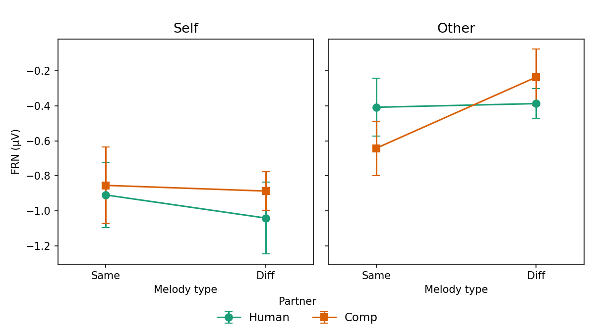

**Figure 2.** Topographic maps of the FRN difference wave (Deviant − Standard) for each of the 8 conditions. Negative values (blue) in frontocentral regions indicate the FRN component.

| Human-Same-Self | Human-Same-Other | Human-Diff-Self | Human-Diff-Other |
|:---:|:---:|:---:|:---:|
| 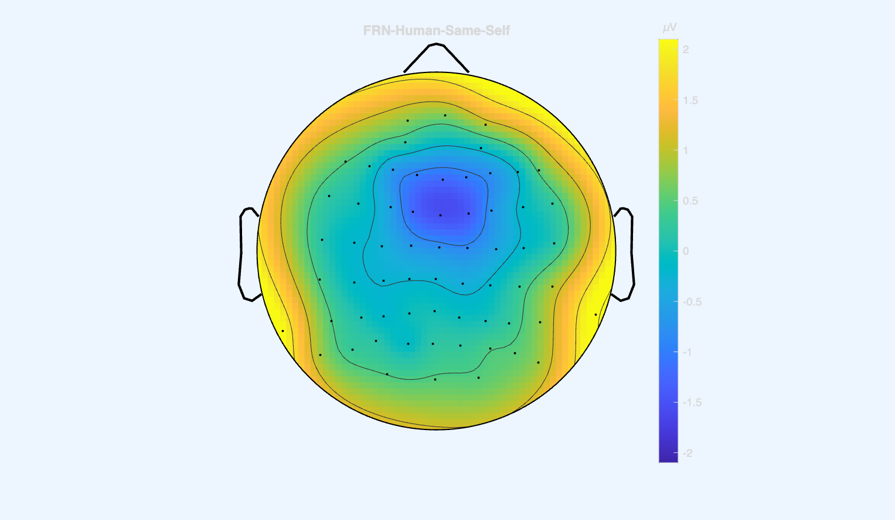 | 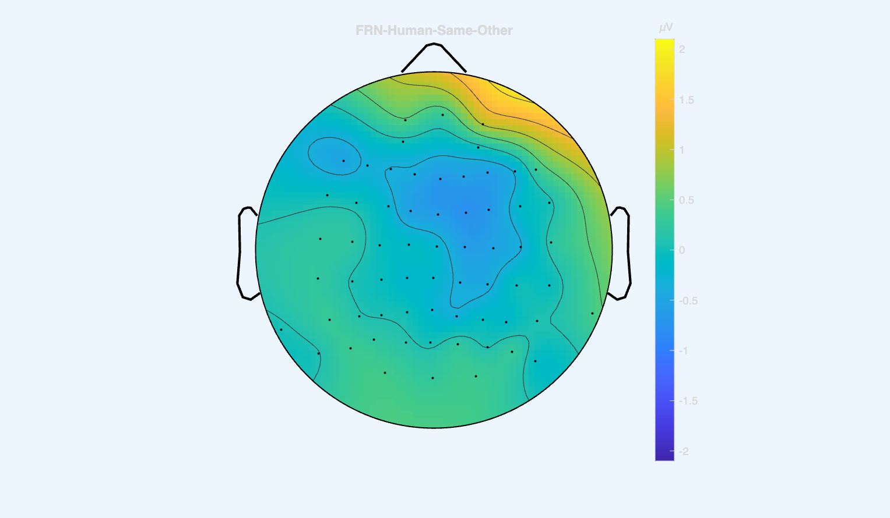 | 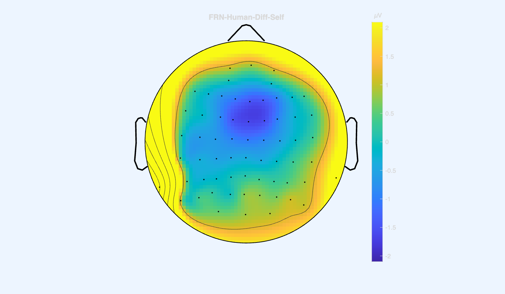 | 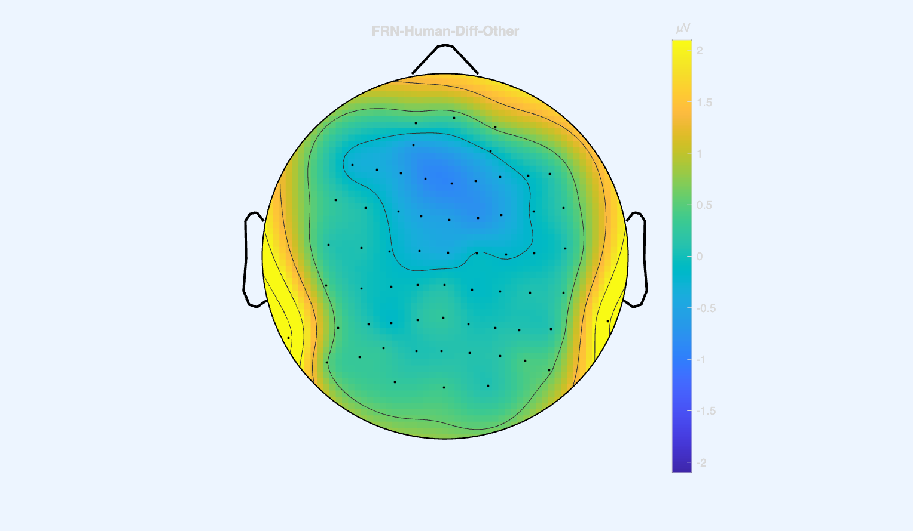 |

| Comp-Same-Self | Comp-Same-Other | Comp-Diff-Self | Comp-Diff-Other |
|:---:|:---:|:---:|:---:|
| 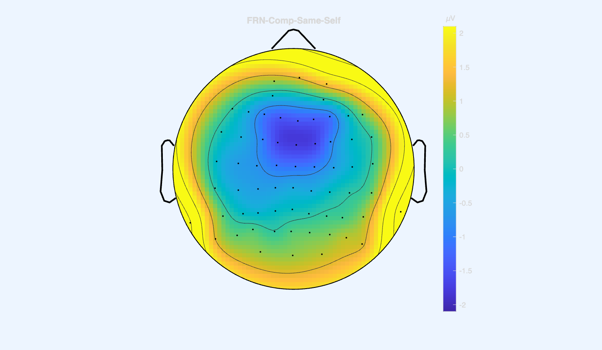 | 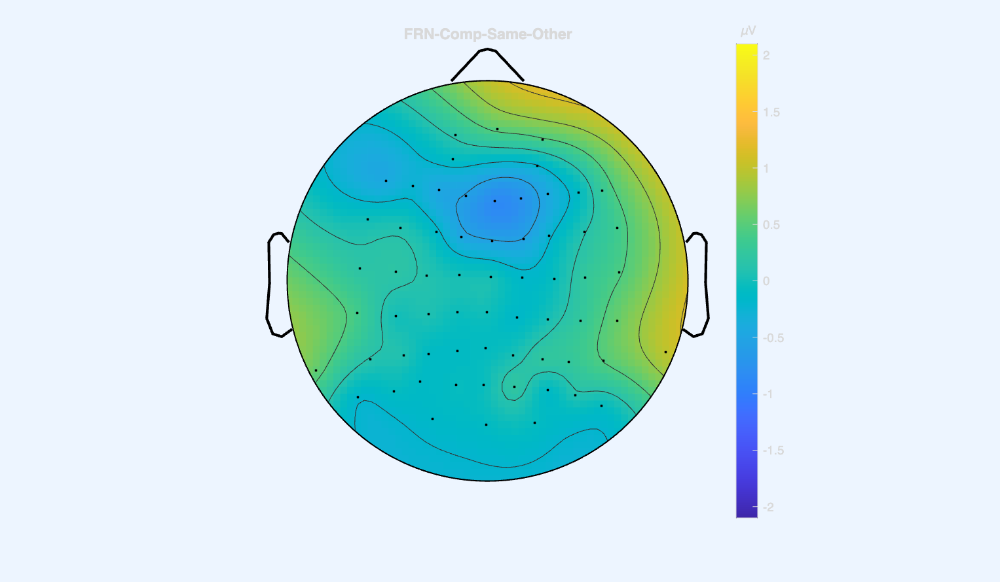 | 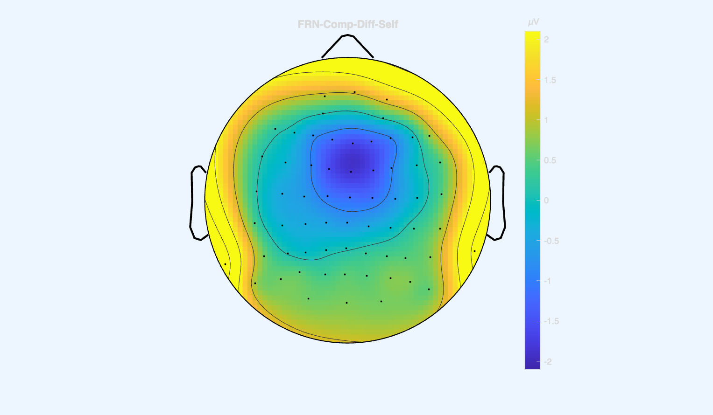 | 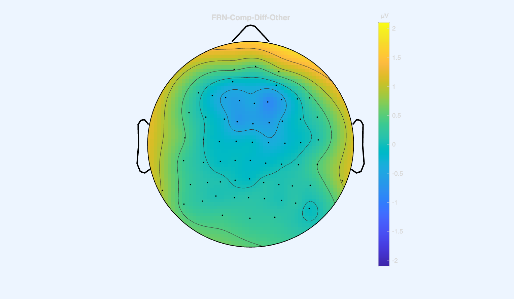 |

### Discussion

Our finding of a significant main effect of Agency replicates the central result of Huberth et al. (2018), who also reported that FRN amplitudes were larger for self-produced altered pitches than for the partner's altered pitches (*F*(1, 17) = 33.32, *p* < .001). This is consistent with the conclusion that performance monitoring in a duet context is stronger for one's own actions than for the partner's actions, in line with the idea that the forward model generates stronger predictions for self-produced motor commands than for observed actions.

However, several differences between our results and those of Huberth et al. (2018) are worth noting. First, our Agency effect, while significant, had a smaller effect size (*ges* = .14) and higher *p*-value (.010 vs. < .001), likely reflecting our smaller sample size (10 vs. 18 participants). Second, we did not find any significant interactions, whereas the overall pattern of results is otherwise consistent — Huberth et al. (2018) also reported no significant effects of Partner type, confirming that whether the duet partner is human or computer does not substantially alter the FRN response.

The smaller sample size is the most likely explanation for the reduced sensitivity. With only 10 participants, statistical power to detect smaller interaction effects is limited. To improve these results, future analyses should include all available pairs rather than restricting to the 5 cleanest pairs, and additional data cleaning procedures (e.g., independent component analysis for artifact rejection) could improve signal-to-noise ratio. Additionally, individual differences in musical training and empathy, which Huberth et al. (2018) found to correlate with FRN amplitude, could be examined as covariates.

---

## 4. Alpha Power Results

### ANOVA Results

Alpha ERD was analyzed from the same 10 participants (5 pairs) used in the FRN analysis. Alpha power (8–13 Hz) was computed as percent change from a pre-onset baseline, averaged within time windows determined by a half-amplitude method (Leader: −0.961 to 0.943 s; Follower: −0.249 to 0.375 s relative to the unison phrase onset). Separate 2 (Melody: Same, Diff) × 2 (Partner: Human, Comp) × 4 (Electrode group: fc, cpl, cpr, po) repeated-measures ANOVAs were conducted for Leader and Follower data.

**Leader.** No main effects or interactions reached significance: Melody, *F*(1, 9) = 0.32, *p* = .586; Partner, *F*(1, 9) = 0.08, *p* = .787; Electrode, *F*(3, 27) = 1.27, *p* = .303; Melody × Partner, *F*(1, 9) = 3.16, *p* = .109; Melody × Electrode, *F*(3, 27) = 1.40, *p* = .264; Partner × Electrode, *F*(3, 27) = 2.16, *p* = .116; Melody × Partner × Electrode, *F*(3, 27) = 1.78, *p* = .174. Although the Melody × Partner interaction did not reach significance (*p* = .109), the descriptive pattern of means showed greater alpha ERD for the human-same condition (*M* = 4.78%) compared to human-diff (*M* = 0.11%), while the computer conditions showed a reversed pattern (comp-same: *M* = 0.75%, comp-diff: *M* = 2.46%).

**Follower.** Similarly, no main effects or interactions reached significance: Melody, *F*(1, 9) = 0.09, *p* = .773; Partner, *F*(1, 9) = 0.70, *p* = .426; Electrode, *F*(3, 27) = 0.99, *p* = .412; Melody × Partner, *F*(1, 9) = 2.65, *p* = .138; Melody × Electrode, *F*(3, 27) = 2.00, *p* = .137; Partner × Electrode, *F*(3, 27) = 0.60, *p* = .618; Melody × Partner × Electrode, *F*(3, 27) = 0.70, *p* = .562. Although the Melody × Partner interaction was not significant, exploratory pairwise comparisons suggested that within the same-melody condition, alpha ERD was numerically greater for the human partner (*M* = 2.77%) than the computer partner (*M* = −2.83%; *t*(9) = 3.03, *p* = .014), though this result should be interpreted with caution given the non-significant omnibus interaction.

### Figures

**Figure 3.** Alpha ERD interaction plot showing mean alpha power change (%) as a function of Melody type, paneled by Role (Leader, Follower), with separate lines for Partner type. Error bars represent Cousineau-Morey within-subject standard errors.

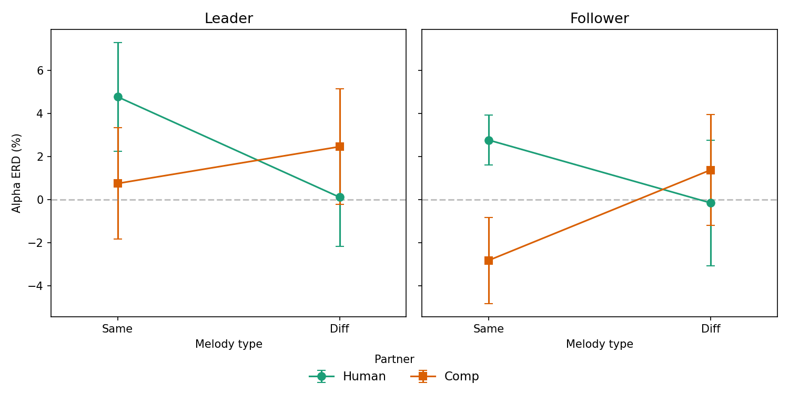

**Figure 4.** Topographic maps of alpha ERD (%) for Leader conditions, averaged within the Leader time window (−0.961 to 0.943 s). Positive values (warm colors) indicate event-related synchronization; negative values (cool colors) indicate desynchronization.

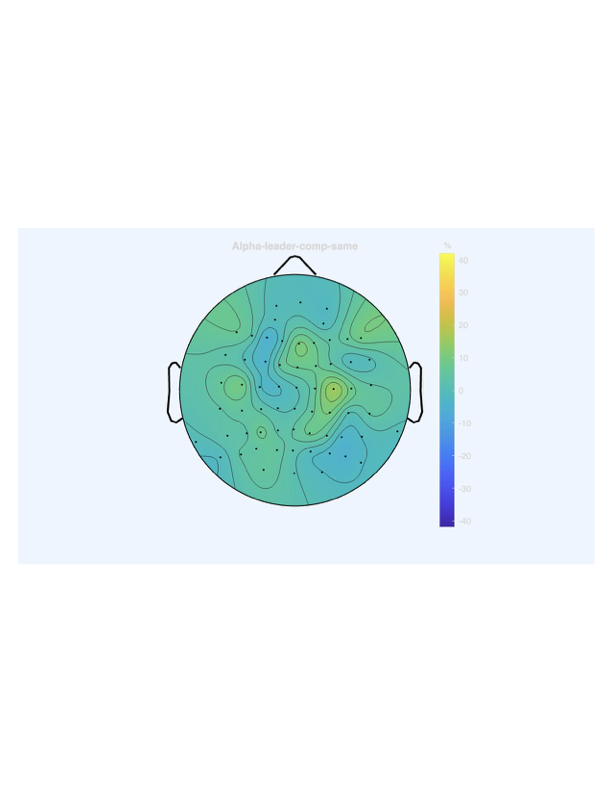

**Figure 5.** Topographic maps of alpha ERD (%) for Follower conditions, averaged within the Follower time window (−0.249 to 0.375 s).

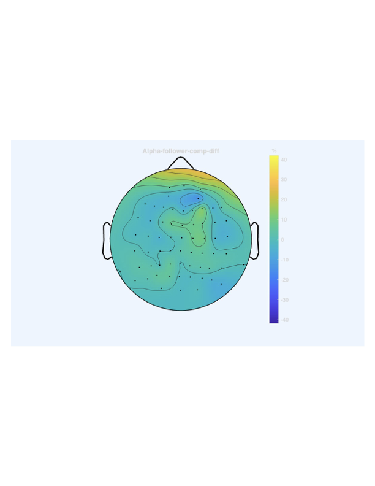

### Discussion

Our Alpha ERD results did not yield significant ANOVA effects for either Leaders or Followers, in contrast to Washburn et al. (2019), who reported a significant Melody × Partner interaction for starting performers (*F*(1, 7) = 5.82, *p* = .047). Washburn et al. found that the key differentiation was with the computer partner: starting performers showed greater alpha synchronization with a similar melody but desynchronization with a dissimilar melody when paired with the computer, whereas human partner conditions did not differ by melody type. In our Leader data, the descriptive pattern was somewhat different — the human-same condition showed the highest alpha ERD (4.78%) while human-diff showed the lowest (0.11%), and the computer conditions were intermediate — though none of these differences reached significance. For Followers, exploratory comparisons suggested greater alpha ERD for human than computer partners in the same-melody condition, though this was not protected by a significant omnibus interaction and should be interpreted cautiously.

Several factors may account for the lack of significant ANOVA effects. First, our sample of 10 participants provides limited statistical power, particularly for the 3-way ANOVA with 4-level electrode factor. Washburn et al. (2019) analyzed 15 participants and still only found their key interaction at *p* = .047. Second, differences in the time windows used for averaging alpha ERD may affect results. Our time windows were determined empirically from the grand average using a half-amplitude method, while Washburn et al. used a slightly different approach. Third, inter-individual variability in alpha ERD is notably large (SDs of 6–12%), which reduces statistical sensitivity with small samples.

To improve these results, including all available pairs (rather than restricting to the 5 cleanest) would increase sample size. Additionally, individual alpha frequency (IAF) estimation could be used to tailor the frequency band to each participant, potentially reducing variability. More sophisticated artifact rejection methods and analysis of time-frequency dynamics (rather than single time-window averages) could also improve sensitivity to the experimental effects.
