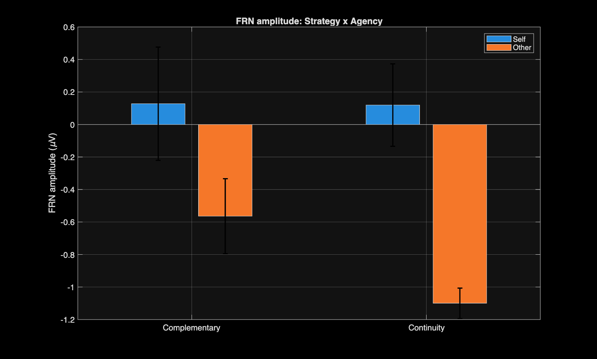
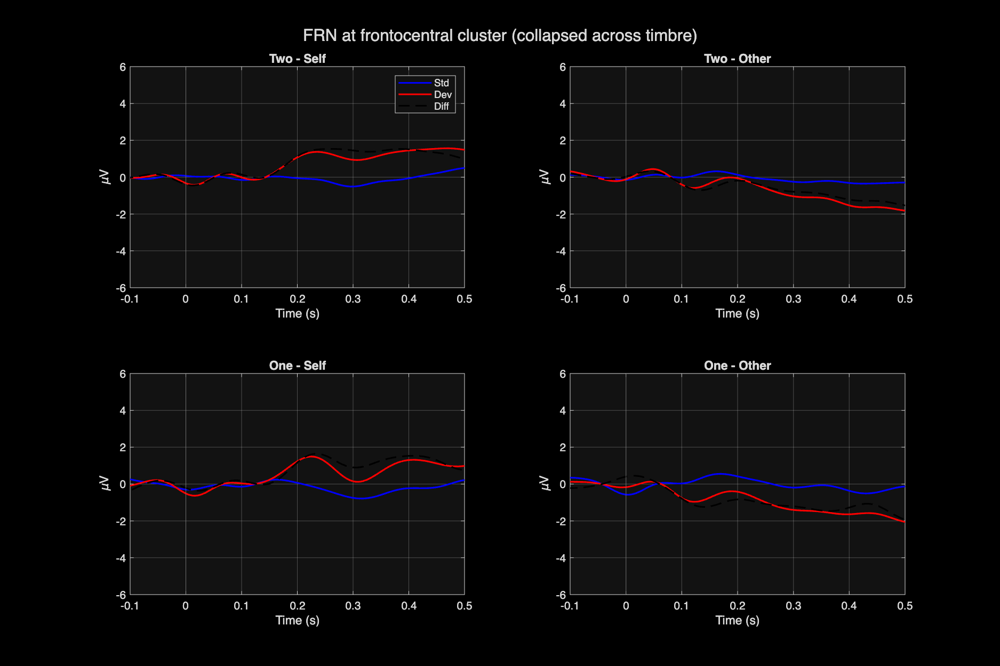
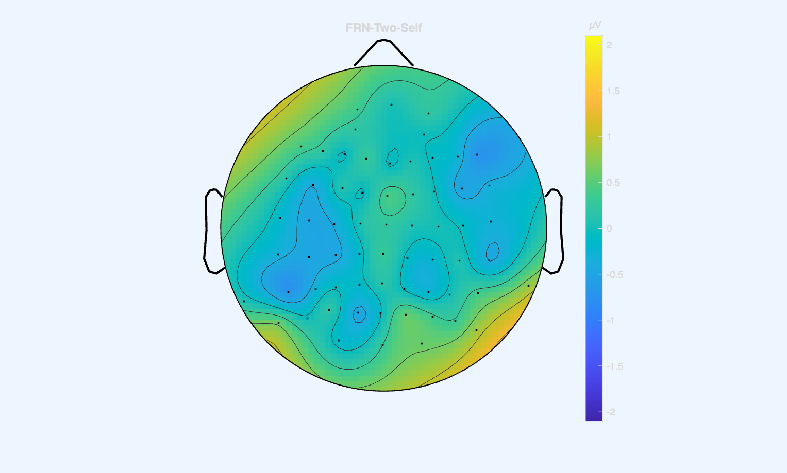
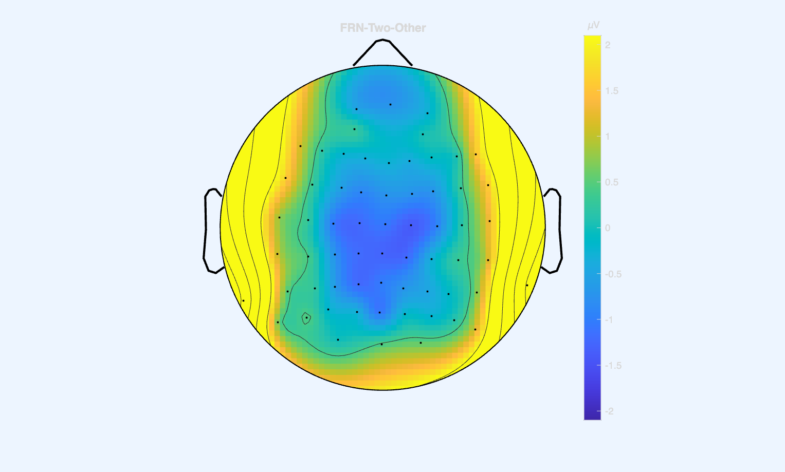
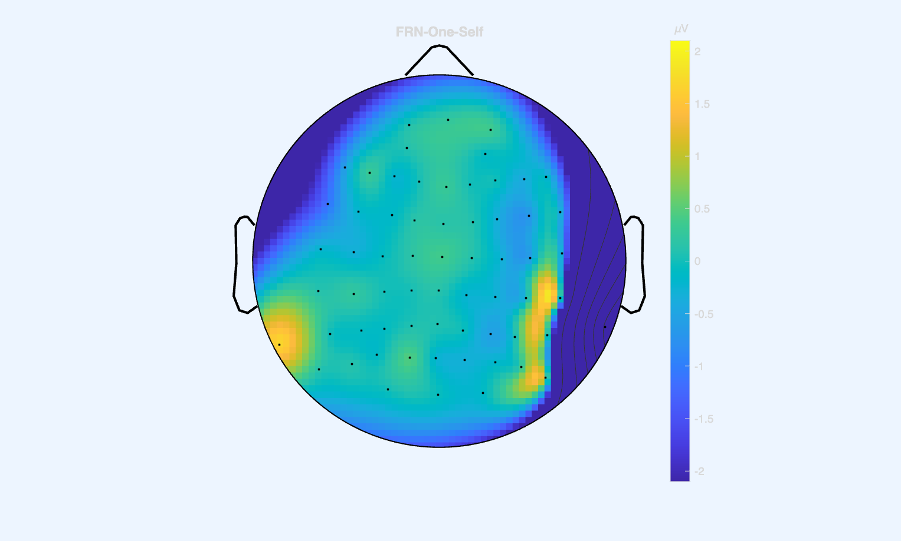
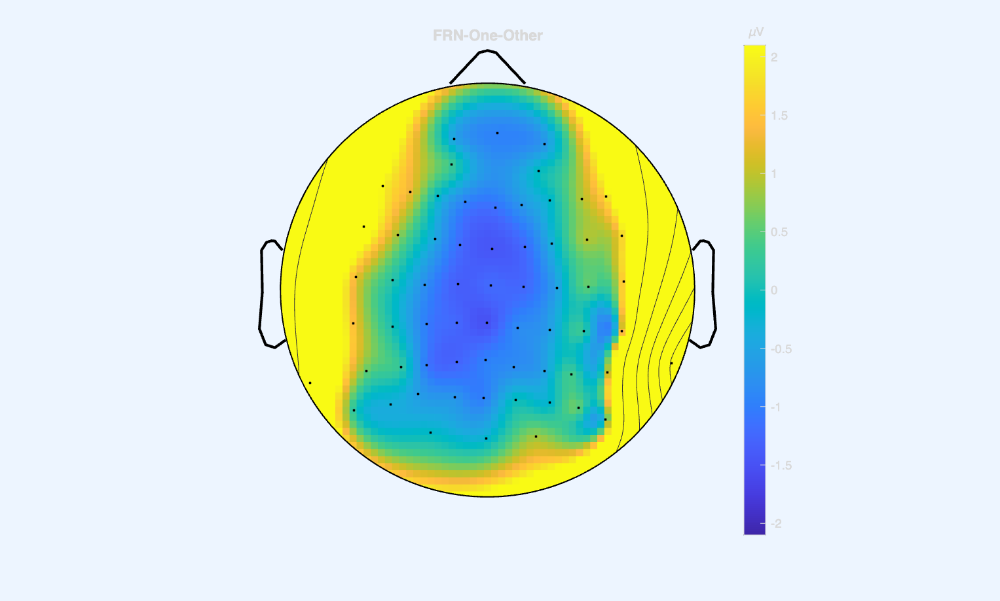

# Music 451C Final Report - W26

**Drum Duet Improvisation: Timbre Deviance Monitoring During Joint Musical Improvisation**

Mateo Larrea / Stanford University

Keywords: FRN, EEG hyperscanning, joint improvisation, performance monitoring, timbre deviance

## Abstract

Performance monitoring during joint action has been studied primarily in structured musical tasks where both players know the notes in advance. The Feedback-Related Negativity (FRN), an ERP component reflecting prediction error, is typically larger for self-produced errors than for the partner's errors in piano duet paradigms (Huberth et al., 2018). The present study examined whether this self-other asymmetry holds during free percussion improvisation, where the musical content is not predetermined. Six musicians (3 pairs) performed a turn-taking drum pad improvisation task under two strategy conditions (Continuity and Complementary) while EEG was recorded simultaneously from both players. Timbre deviants were inserted during each player's phrases, drawn either from the player's own instrument set (MyTimbre) or from the partner's instrument category (PartnerTimbre). We found a significant reversal of the typical agency effect: deviants during the partner's playing elicited a larger FRN (*M* = -0.832 uV) than deviants during one's own playing (*M* = +0.123 uV), *t*(5) = 7.04, *p* < .001. Deviants from the partner's instrument set also produced a larger FRN than those from one's own set (*p* = .019). No significant effect of improvisation strategy was observed. These preliminary results suggest that free improvisation may shift the balance of performance monitoring toward the partner's output, possibly because the cognitive demands of real-time musical generation reduce self-monitoring while active listening during the partner's turn amplifies other-monitoring.

## 1. Introduction

### The FRN in Performance Monitoring and Joint Action

The Feedback-Related Negativity (FRN) is an event-related potential (ERP) component measured with electroencephalography (EEG) that peaks approximately 200-300 ms after the onset of unexpected or error-related feedback, exhibiting a frontocentral scalp distribution. The FRN is generated in the medial frontal cortex, a region broadly implicated in cognitive control and performance monitoring (Ridderinkhof et al., 2004), and is thought to reflect a prediction error signal: when actual sensory outcomes deviate from predicted outcomes, this region generates a rapid evaluative response (Holroyd & Coles, 2002). This component is central to the perception-action cycle, the continuous loop through which the brain issues motor commands, predicts their sensory consequences via a forward model, and adjusts behavior based on mismatches between predicted and actual feedback (Blakemore & Decety, 2001).

In joint action contexts, performance monitoring must extend beyond one's own actions. Sebanz et al. (2006) proposed that successful coordination requires co-representation, the formation of shared task representations that incorporate both one's own and the partner's actions. Musical ensemble performance is well suited for studying this question, as musicians must continuously monitor their own output while tracking the partner's contributions to maintain temporal and tonal coherence. Loehr et al. (2013) demonstrated that pianists performing duets generate FRN and P300 responses not only to errors in their own playing but also to errors in the joint outcome, suggesting that the brain monitors multiple levels of action outcomes during joint performance. Huberth et al. (2018) examined this directly in a turn-taking piano duet with EEG hyperscanning. They found that FRN amplitudes were significantly larger for altered feedback in one's own part compared to the partner's part (*F*(1, 17) = 33.32, *p* < .001), suggesting that the forward model generates stronger prediction errors for self-produced than for observed actions. They also found no significant effect of whether the partner was human or computer, indicating that the biological animacy of the interaction partner does not substantially modulate performance monitoring during structured musical turn-taking.

### From Structured Duets to Free Improvisation

The Piano Duet 2017 paradigm used pre-composed melodies: participants knew what notes they were supposed to play and what notes their partner would play. This raises the question of whether the self-other asymmetry in error monitoring holds when the musical content is not predetermined. In free improvisation, the forward model operates under greater uncertainty. One cannot predict exactly what one will play next, let alone what the partner will play. This changes the nature of expectation and prediction error in ways that are difficult to anticipate from the existing literature.

Joint musical improvisation also introduces a dimension absent from structured duets: the strategy of interaction. Two musicians can coordinate either through *continuity*, where both players build one shared musical idea and each turn develops and extends what the partner just played, or through *complementarity*, where players bring different but related musical characters, as in a dialogue of contrasting voices (Canonne & Garnier, 2012). These two modes may place different demands on the performance monitoring system. Continuity requires tighter co-representation, as each player must track and continue the partner's musical thread. Complementarity grants each player more independence, which could reduce the need to closely monitor the partner's output.

### Timbre Deviants in Percussion

The present study extends the hyperscanning paradigm to percussion improvisation. Instead of pitch alterations in piano melodies, deviants consist of timbre substitutions in drum pad sounds. Each player is assigned an instrument category (Timbale or Conga) with 4 pitched sounds mapped to 4 pad positions. Two types of timbre deviants are introduced. The first type, MyTimbre deviants, are higher-pitched variants from the player's own instrument category (e.g., Timbale 5 instead of Timbale 2). These remain within the player's action space: the sound is something the player's pad could produce, though it is not what the player intended. The second type, PartnerTimbre deviants, are drawn from the partner's instrument category (e.g., a Conga sound appearing on a Timbale player's pad). These are outside the player's action space entirely, because the player's pad does not normally produce these sounds.

This distinction between deviant sources is relevant because the forward model may generate predictions differently for sounds within versus outside one's own action repertoire. Loehr and Palmer (2011) showed that musicians form internal models of both their own and their partner's contributions during joint performance, and the precision of those models may depend on whether the predicted sound belongs to one's own instrument. If the FRN is primarily driven by violations of one's own motor plan, then MyTimbre deviants (still within one's action space) and PartnerTimbre deviants (outside one's action space) might elicit different responses.

### Hypotheses

Based on the existing literature, we tested the following predictions:

1. **Agency (Self vs. Other):** Based on Huberth et al. (2018), we expected that deviants during one's own playing (Self) would elicit a larger FRN than deviants during the partner's playing (Other), reflecting stronger forward-model predictions for self-generated actions. However, an alternative prediction is that the cognitive demands of improvisation reduce self-monitoring while active listening during the partner's turn amplifies other-monitoring, which would produce the opposite pattern.

2. **Strategy (Continuity vs. Complementary):** We expected that the Continuity condition, which requires closer tracking of the partner's musical ideas, might produce larger FRN amplitudes overall (or at least for Other deviants) compared to the Complementary condition. Alternatively, if the strategy manipulation does not change how participants process unexpected timbres, no difference would be expected.

3. **Timbre type (MyTimbre vs. PartnerTimbre):** We expected that PartnerTimbre deviants, which originate from outside the player's action space, might elicit a larger FRN than MyTimbre deviants, which remain within the set of sounds the player could produce. Alternatively, if timbre source does not matter and only the fact of a mismatch drives the FRN, no difference would be expected.

## 2. Methods

### Participants

Six musicians (3 pairs) participated in the experiment. All were right-handed.

| ID | Age | Gender | Absolute Pitch | Musical Experience |
|----|-----|--------|----------------|--------------------|
| UV | 23 | M | Yes | 17 years (from age 6) |
| ML | 27 | M | No | 11 years (from age 16) |
| LJ | 24 | F | No | 19 years (from age 5) |
| TF | 58 | F | Yes | 54 years (from age 4) |
| CM | 34 | M | No | 29 years (from age 5) |
| MG | 26 | NB | No | 18 years (from age 8) |

Pairs were: UV-ML, LJ-TF, CM-MG. Three participants were male, two female, and one non-binary. Participants were 23-58 years old (*M* = 32.0, *SD* = 13.1) and had 11 to 54 years of musical training (*M* = 28.0, *SD* = 15.2). Two participants had absolute pitch (UV, TF).

### Apparatus and Stimuli

Each participant performed on a drum pad (Novation Launchpad, Focusrite Group, High Wycombe, UK) connected to a Max/MSP patch (Cycling '74, San Francisco, CA) running on a MacBook Air. One pad was assigned to a Timbale sound set and the other to a Conga sound set. Each set consisted of 7 pitched sounds (low to high), with the lower 4 mapped to the pad positions and the upper 3 serving as potential deviants. Higher-pitched variants of the same instrument category served as MyTimbre deviants. Sounds from the partner's instrument category served as PartnerTimbre deviants. The patch controlled trial sequencing, metronome generation (100 BPM, 4/4 time), deviant insertion, and trigger code output to the EEG system via USB/Arduino.

EEG was recorded simultaneously from both participants using two Neuroscan SynAmps RT systems (Compumedics Neuroscan, Charlotte, NC) with 64 EEG channels plus VEO, HEO, and Trigger channels (67 total per participant), using the Neuroscan Quik-cap montage at 500 Hz sampling rate.

### Task

Participants improvised together in a turn-taking structure. Each trial began with a 4-beat metronome count-in (100 BPM), followed by 6 alternating phrases (Starter: phrases 1, 3, 5; Joiner: phrases 2, 4, 6). Each phrase contained at least 5 notes. After the 6th phrase, the Starter played 2 notes alone, and then both players finished the ending together (phrase 7). Trials were scored by the Max/MSP patch as successful (trigger code 81), error (80), or aborted (79) based on adherence to the turn-taking structure and completion of the ending figure.

### Experimental Design

Two factors were manipulated across blocks. The first was improvisation strategy (between blocks): in *Continuity* (One-part) blocks, both players worked to build one shared musical idea, with each turn extending the partner's contribution; in *Complementary* (Two-part) blocks, players brought different but related musical characters, responding with contrasting ideas. The second factor was start order (between blocks): P1start (SubA starts) vs. P2start (SubB starts), counterbalanced.

This yielded 4 block types (2 Strategy x 2 Start order), with 2 blocks per type for 8 blocks total. Each block contained 2 practice trials and 27 test trials (29 total). Blocks lasted approximately 10 minutes each; total session time was approximately 170 minutes (about 2 hours 50 minutes) including setup, capping, instruction, and questionnaires.

Within each trial, one timbre deviant was inserted in one of the Starter's phrases (1, 3, or 5) and one in one of the Joiner's phrases (2, 4, or 6). The deviant could be a MyTimbre or PartnerTimbre deviant. The assignment of Self vs. Other was determined by who was playing the phrase containing the deviant: if the deviant appeared during your own phrase, it was a Self deviant; if it appeared during your partner's phrase, it was an Other deviant.

### EEG Preprocessing

All preprocessing was conducted in MATLAB (MathWorks, Natick, MA) using Brainstorm (Tadel et al., 2011). The pipeline followed the same steps as the EX 1 Piano Duet analysis:

1. **Raw data import:** .cnt files linked to Brainstorm (protocol: Duet2026), channel montage replaced with Neuroscan Quik-cap (67).
2. **Trigger processing:** Custom MATLAB script parsed trigger codes, identified successful trials (code 81), classified deviants as DevSelf/DevOther x MyTimbre/PartnerTimbre x Continuity/Complementary, and extracted the preceding standard note for each deviant.
3. **Eye artifact removal:** SSP (Signal Space Projection) computed from vertical and horizontal EOG channels (VEO, HEO) on the first run per subject.
4. **Continuous import:** All 8 runs imported with SSP applied.
5. **Drift correction:** repair_steps_12_data2 applied to correct 10-second step artifacts from AD conversion.
6. **Epoching:** Epochs extracted from -500 to +1000 ms around each event onset for 16 conditions (Dev/Std x Self/Other x MyTimbre/PartnerTimbre x Continuity/Complementary).
7. **Artifact rejection:** Peak-to-peak threshold of 250 uV applied to reject bad channels.
8. **Averaging:** Subject-level averages computed per condition.
9. **Time offset:** -21 ms correction applied for Arduino trigger delay.
10. **Baseline correction:** DC offset correction using -50 to 0 ms window.

### FRN Measurement

Averaged ERP data were exported from Brainstorm and further processed in MATLAB. Data were converted to microvolts, lowpass filtered at 40 Hz (4th-order Butterworth, zero-phase), and baseline-corrected (-100 to 0 ms). Difference waveforms (Deviant - Standard) were computed for each condition. A frontocentral electrode cluster (F1, Fz, F2, FC1, FCz, FC2) was used as the region of interest, consistent with the expected FRN scalp distribution.

FRN time windows were determined from the grand-average difference waveform collapsed across all conditions using a half-amplitude method: the most negative peak was identified between 100 and 300 ms (FRN peak: 135 ms), and the measurement window was defined as the interval where the waveform exceeded 50% of the peak-to-trough amplitude on either side (FRN window: 99-177 ms). A P3a window was similarly defined (177-265 ms). Mean amplitude within the FRN window was used as the dependent measure.

## 3. Results

The FRN was measured as the mean amplitude of the difference waveform (Deviant minus Standard) within the FRN time window (99-177 ms) at the frontocentral electrode cluster (F1, Fz, F2, FC1, FCz, FC2). Grand-average ERP waveforms (Figure 2) show that the Other conditions produced a clear separation between Standard and Deviant waveforms, with a negative deflection peaking around 135 ms followed by a positive rebound. The Self conditions showed largely overlapping Standard and Deviant waveforms. The difference waves accordingly showed a clear FRN and P3a (around 220 ms) for Other conditions, but remained near zero for Self conditions. Topographic maps (Figure 3) showed that the Other-condition negativity was distributed over central and centroparietal scalp regions.

### Descriptive Statistics

Mean FRN amplitude (Dev - Std difference wave, frontocentral cluster, 99-177 ms) for each condition:

| Strategy | Agency | *M* (uV) | *SE* |
|----------|--------|----------|------|
| Complementary | Self | +0.128 | 0.349 |
| Complementary | Other | -0.564 | 0.231 |
| Continuity | Self | +0.119 | 0.254 |
| Continuity | Other | -1.099 | 0.094 |

### Agency: Self vs. Other

Collapsing across strategy and timbre, FRN amplitude differed significantly between Self (*M* = +0.123 uV, *SE* = 0.173) and Other (*M* = -0.832 uV, *SE* = 0.122) conditions, *t*(5) = 7.04, *p* < .001. The direction of this effect is the reverse of what Huberth et al. (2018) reported: in the present data, the Other condition (deviants during the partner's playing) produced a significantly more negative FRN than the Self condition (deviants during one's own playing). The Self condition showed no FRN at all (mean amplitude was slightly positive), while the Other condition showed a clear negative deflection.

This pattern was consistent across both strategy conditions: the Other FRN was more negative than Self for both Complementary (-0.564 vs. +0.128 uV) and Continuity (-1.099 vs. +0.119 uV).

### Strategy: Complementary vs. Continuity

Collapsing across agency and timbre, FRN amplitude did not differ significantly between Complementary (*M* = -0.218 uV, *SE* = 0.264) and Continuity (*M* = -0.490 uV, *SE* = 0.133), *t*(5) = 0.85, *p* = .436. The Continuity condition showed descriptively more negative FRN, particularly driven by the large Other-Continuity effect, but the difference was not statistically reliable.

### Timbre Type: MyTimbre vs. PartnerTimbre

Collapsing across strategy and agency, FRN amplitude differed significantly between MyTimbre (*M* = -0.156 uV, *SE* = 0.165) and PartnerTimbre (*M* = -0.552 uV, *SE* = 0.125) conditions, *t*(5) = 3.39, *p* = .019. Deviants from the partner's instrument set produced a larger (more negative) FRN than deviants from one's own instrument set.

### Topographic Distribution

Topographic maps of the FRN difference wave confirmed a centroparietal distribution for the Other conditions (both Complementary and Continuity), with clear negative deflections over central and centroparietal electrodes. The Self conditions showed minimal or no frontocentral negativity. The Other-Continuity condition showed the most broadly distributed and strongly negative topography.

### Figures

**Figure 1.** Bar plot of mean FRN amplitude (uV) at the frontocentral electrode cluster (99-177 ms window) as a function of Strategy (Complementary, Continuity) and Agency (Self, Other). Error bars represent standard error of the mean. The Self-Other difference is visible in both strategy conditions, with no FRN for Self deviants and a clear negative FRN for Other deviants.

**Figure 2.** Grand average ERP waveforms at the frontocentral electrode cluster for each Strategy x Agency condition, collapsed across timbre. Blue lines show the Standard ERP, red lines show the Deviant ERP, and the black dashed line shows the difference wave (Dev - Std). The Other conditions (right column) show a clear deviant-standard separation, while the Self conditions (left column) show largely overlapping waveforms.

**Figure 3.** Topographic maps of the FRN difference wave (Dev - Std) for each Strategy x Agency condition, averaged within the FRN time window (99-177 ms). Color scale ranges from -2 to +2 uV. Blue regions indicate negative difference (FRN). The Other conditions show broad centroparietal negativity, while the Self conditions show minimal differentiation.

| | Self | Other |
|---|:---:|:---:|
| **Complementary** |  |  |
| **Continuity** |  |  |

## 4. Discussion

### A Reversed Agency Effect

The central finding of this study is a reversal of the self-other asymmetry reported by Huberth et al. (2018). In their piano duet study, self-produced deviants elicited a larger FRN than the partner's deviants, consistent with the forward model generating stronger predictions for one's own motor output. In the present improvisation study, we found the opposite: deviants during the partner's playing produced a clear FRN (*M* = -0.832 uV, *p* < .001), while deviants during one's own playing produced no measurable FRN (*M* = +0.123 uV).

Several factors may explain this reversal. The turn-taking structure of the task creates a clear distinction between playing and listening phases. When the partner plays, the participant is not playing and can devote full attentional resources to auditory monitoring. During one's own phrases, attention is divided between motor planning, execution, and monitoring. This is consistent with the perception-action cycle framework (Blakemore & Decety, 2001), in which the forward model's predictions depend on available cognitive resources. In the Piano Duet study, the motor demands of playing pre-composed melodies were relatively low, leaving more resources for self-monitoring. In improvisation, generating novel musical content in real time may consume the resources that would otherwise support error detection during one's own turn.

The medial frontal cortex generates rapid evaluative signals when outcomes deviate from predictions (Ridderinkhof et al., 2004), and the precision of those predictions also differs between the two paradigms. In a pre-composed duet, the forward model can generate exact predictions for one's own notes because they are known in advance. In improvisation, the player does not know exactly what they will play until they play it, reducing the precision of self-predictions. During the partner's turn, however, the listener is actively anticipating how the partner's phrase will develop, especially after having just played a phrase that sets up musical expectations for the response. This could produce stronger prediction errors for the partner's output than for one's own.

Finally, joint improvisation places a premium on listening to the partner in order to coordinate the next response (Canonne & Garnier, 2012). In a structured duet, the partner's contribution is predetermined and can be monitored more passively; in improvisation, the heightened listening demand may amplify error monitoring of the partner's output.

We note that this finding should be interpreted cautiously given the small sample size (N = 6). The effect is large and statistically significant, and it is consistent across both strategy conditions, but replication with a larger sample is needed.

### Timbre Source: Own Set vs. Partner's Set

The significant effect of timbre type (*p* = .019) suggests that the brain distinguishes between deviants based on their timbral source. Deviants from the partner's instrument set (sounds categorically foreign to one's own pad) produced a larger FRN than deviants from one's own set. A PartnerTimbre deviant is maximally unexpected in the sense that it does not belong to the set of sounds the participant has been producing or could produce on their pad. A MyTimbre deviant, while still unexpected, comes from a higher-pitched variant of the participant's own instrument category and may be partially accommodated by the auditory system as a plausible variation. This finding is consistent with the idea that musicians form internal models tied to their own instrument and the partner's instrument (Loehr & Palmer, 2011; Loehr et al., 2013), and that deviants crossing the boundary between these representations produce larger prediction errors.

### Strategy: No Reliable Modulation

The lack of a significant strategy effect suggests that the Continuity vs. Complementary instruction did not produce reliably different patterns of error monitoring at the current sample size. Sebanz et al. (2006) proposed that joint action requires co-representation of the partner's task, and one might expect that Continuity demands tighter co-representation than Complementary. However, both conditions still require active listening and turn-taking coordination, which may impose a similar baseline level of partner monitoring. Descriptively, the Continuity condition showed somewhat more negative FRN (particularly for Other deviants: -1.099 vs. -0.564 uV), which would be consistent with the idea that building a shared musical idea requires closer monitoring of the partner. However, this difference did not reach significance, and with only 6 participants we cannot distinguish between a true null and insufficient power.

### Strengths, Limitations, and Future Directions

Despite the small sample, this study has several strengths. It is, to our knowledge, the first to examine the FRN during free percussion improvisation with EEG hyperscanning. The significant agency and timbre effects, obtained with only 6 participants, suggest that these effects are large and may be replicable. The automated Brainstorm preprocessing pipeline used here is directly transferable to larger samples.

The study also has clear limitations. With 6 participants (3 pairs), statistical power is limited. We reported paired t-tests on collapsed conditions rather than a full factorial ANOVA, which would require a larger sample to estimate interaction effects. The age range (23-58) and experience range (11-54 years) are wide; TF, with 54 years of experience and absolute pitch, may process deviants differently from less experienced participants. The FRN peak (135 ms) is earlier than the typical 200-300 ms range for pitch-based FRN, which may reflect faster timbre processing or may indicate that we are capturing a different component such as an early mismatch negativity.

Future studies should increase the sample size to at least 10-12 pairs, which would enable a full 2 x 2 x 2 repeated-measures ANOVA and permit examination of the Strategy x Agency interaction that is hinted at descriptively in the present data. Individual differences in musical experience and improvisation skill could be examined as covariates. Behavioral measures of improvisation quality (e.g., ratings by expert listeners) could be correlated with the neural measures to test whether better improvisers show different patterns of self- vs. other-monitoring.

### Conclusion

In summary, this study used EEG hyperscanning to examine the FRN during free percussion improvisation with timbre deviants in a turn-taking duet task. The results revealed a reversal of the self-other asymmetry previously reported in structured piano duets (Huberth et al., 2018): deviants during the partner's playing elicited a larger FRN than deviants during one's own playing. Additionally, deviants from the partner's instrument set produced a larger FRN than those from one's own set, suggesting that the forward model distinguishes between timbral sources based on action ownership. Together, these findings suggest that the cognitive demands of real-time improvisation may shift performance monitoring toward the partner's output, reversing the pattern seen in structured duets. Replication with a larger sample and a full factorial design will be needed to confirm these effects and clarify their boundary conditions.

## References

Blakemore, S.-J., & Decety, J. (2001). From the perception of action to the understanding of intention. *Nature Reviews Neuroscience*, *2*(8), 561-567.

Canonne, C., & Garnier, N. B. (2012). Cognition and segmentation in collective free improvisation: An exploratory study. *Proceedings of the 12th International Conference on Music Perception and Cognition*.

Holroyd, C. B., & Coles, M. G. H. (2002). The neural basis of human error processing: Reinforcement learning, dopamine, and the error-related negativity. *Psychological Review*, *109*(4), 679-709.

Huberth, M., Dauer, T., Nanou, C., Roman, I., Gang, N., Reid, W., Wright, M., & Fujioka, T. (2018). Performance monitoring of self and other in a turn-taking piano duet: A dual-EEG study. *Social Neuroscience*, *14*(4), 449-461.

Loehr, J. D., Kourtis, D., Vesper, C., Sebanz, N., & Knoblich, G. (2013). Monitoring individual and joint action outcomes in duet music performance. *Journal of Cognitive Neuroscience*, *25*(7), 1049-1061.

Loehr, J. D., & Palmer, C. (2011). Temporal coordination between performing musicians. *Quarterly Journal of Experimental Psychology*, *64*(11), 2153-2167.

Ridderinkhof, K. R., Ullsperger, M., Crone, E. A., & Nieuwenhuis, S. (2004). The role of the medial frontal cortex in cognitive control. *Science*, *306*(5695), 443-447.

Sebanz, N., Bekkering, H., & Knoblich, G. (2006). Joint action: Bodies and minds moving together. *Trends in Cognitive Sciences*, *10*(2), 70-76.

Tadel, F., Baillet, S., Mosher, J. C., Pantazis, D., & Leahy, R. M. (2011). Brainstorm: A user-friendly application for MEG/EEG analysis. *Computational Intelligence and Neuroscience*, *2011*, 879716.
